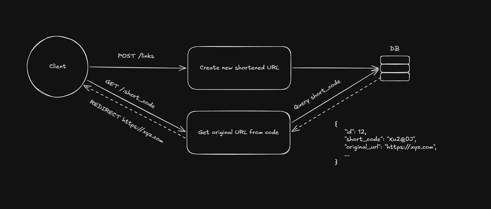
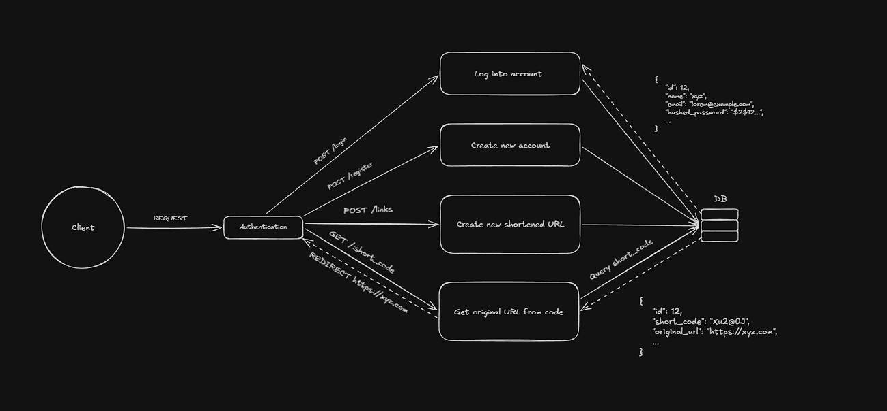

# Gravity

> One URL shortener to rule them all.

## Description

Gravity is a URL shortener built as a long-term backend engineering project. The goal isn't just to shorten URLs, it's to
gradually evolve the project into a production-ready service by adding better architecture, performance optimizations,
security, testing, observability, and scalability over time.

Each version represents another step toward that goal.

## Tech Stack

* Node.js
* Express.js
* SQLite

## System Design Evolution

The diagrams below document how Gravity's architecture has evolved over time. Rather than replacing old designs, each
version serves as a snapshot of the project's progression.

### v0.5

### v1

