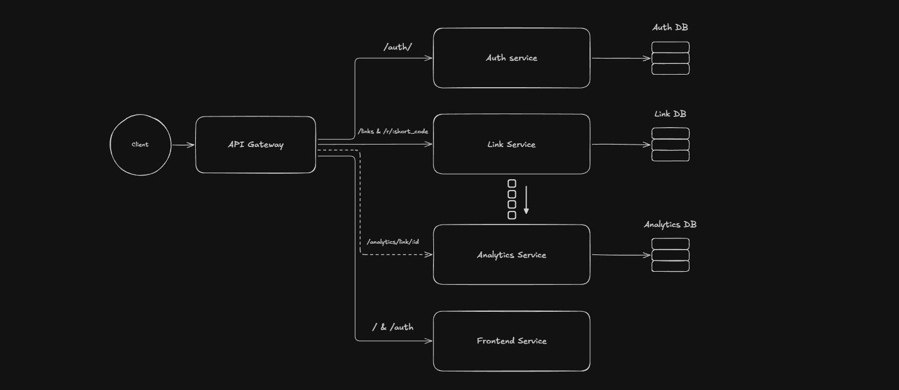
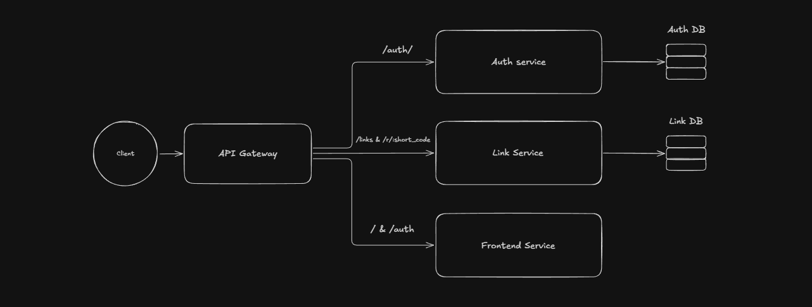

Status: Finished - This project is done and I don't plan on making further updates.
# Gravity

> One URL shortener to rule them all.

## Description

Gravity is a URL shortener built as a long-term backend engineering project. The goal isn't just to shorten URLs, it's to
gradually evolve the project into a production-ready service by adding better architecture, performance optimizations, scalability, etc. over time.

Each version represents another step toward that goal.

## Tech Stack

- Node.js
- Express.js
- RabbitMQ
- SQLite
- Docker
- http-proxy-middleware (API Gateway / request routing)
  
## How to use
You can use gravity through Docker.

Clone the repository:
```bash
git clone https://github.com/MrMM7/gravity.git
```

CD into the project's src/ directory:
```bash
cd gravity/src
```

Run the following command to start the service:
```bash
docker compose up
```

Now the application should be running on http://localhost:3000.

To stop the service, run:
```bash
docker compose down
```

## Documentation

To see all the API endpoints and their usage, visit the [API Documentation](http://localhost:3000/api-docs) page.

## Frontend Note

Gravity is primarily a backend-focused project. The main goal of this project is to explore and demonstrate backend concepts such as API design, database interactions, application structure, and deployment.

The frontend exists only as a simple interface to interact with the backend services and is not the main focus of the project. Most of the frontend implementation was generated with the assistance of AI tools, allowing the focus to remain on the backend architecture and engineering decisions.

## System Design Evolution

The diagrams below document how Gravity's architecture has evolved over time. Rather than replacing old designs, each
version serves as a snapshot of the project's progression.
If you want to see the original board used for these systems below check this [Excalidraw board](https://excalidraw.com/#json=0xt9jqygoXfPMtenrc5OC,FEkaH7QezPnkwKsMZrWA8g).

### v2



### v1.5



### v1


### v0.5


